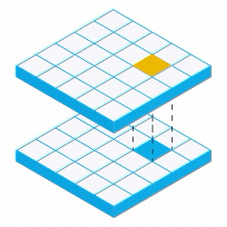

# Map Algebra

Map Algebra is a name given by Dr. Dana Tomlin in the 1980's to a way of manipulating
and transforming raster data. There is a lot of literature out there, not least
[the book by the guy who "wrote the book" on map algebra](http://esripress.esri.com/display/index.cfm?fuseaction=display&websiteID=228&moduleID=0),
so we will only give a brief introduction here.
GeoTrellis follows Dana's vision of map algebra operations,
although there are many operations that fall outside of the realm of Map Algebra that it also supports.

## Categories of Map Algebra operations

Map Algebra operations fall into 3 general categories:

### Local



Local operations are ones that only take into account the information of on cell at a time.
In the animation above, we can see that the blue and the yellow cell are combined, as
they are corresponding cells in the two tiles. It wouldn't matter if the tiles were bigger
or smaller - the only information necessary for that step in the local operation is
the cell values that correspond to each other. A local operation happens for each
cell value, so if the whole bottom tile was blue and the upper tile were yellow, then
the resulting tile of the local operation would be green.

### Focal


Focal operations take into account a cell, and a neighborhood around that cell.
A neighborhood can be defined as a square of a specific size, or include masks so that
you can have things like circular or wedge-shaped neighborhoods. In the above animation,
the neighborhood is a 5x5 square around the focal cell. The focal operation in the animation
is a `focalSum`. The focal value is 0, and all of the other cells in the focal neighborhood;
therefore the cell value of the result tile would be 8 at the cell corresponding to the
focal cell of the input tile. This focal operation scans through each cell of the raster.
You can imagine that along the border, the focal neighborhood goes outside of the bounds
of the tile; in this case the neighborhood only considers the values that are covered
by the neighborhood. GeoTrellis also supports the idea of an analysis area, which is the
GridBounds that the focal operation carries over, in order to support composing tiles with
border tiles in order to support distributed focal operation processing.

### Zonal

Zonal operations are ones that operate on two tiles: an input tile, and a zone tile. The
values of the zone tile determine what zone each of the corresponding cells in the
input tile belong to. For example, if you are doing a `zonalStatistics` operation,
and the zonal tile has a distribution of zone 1, zone 2, and zone 3 values, we will get
back the statistics such as mean, median and mode for all cells in the input tile that correspond
to each of those zone values.

## How to use Map Algebra operations

Map Algebra operations are defined as implicit methods on `Tile` or `Traversable[Tile]`,
which are imported with `import geotrellis.raster._`.

```scala
import geotrellis.raster._

val tile1: Tile = ???
val tile2: Tile = ???

// If tile1 and tile2 are the same dimensions, we can combine
// them using local operations

tile1.localAdd(tile2)

// There are operators for some local operations.
// This is equivalent to the localAdd call above

tile1 + tile2

// There is a local operation called "reclassify" in literature,
// which transforms each value of the function.
// We actually have a map method defined on Tile,
// which serves this purpose.

tile1.map { z => z + 1 } // Map over integer values.

tile2.mapDouble { z => z + 1.1 } // Map over double values.

tile1.dualMap({ z => z + 1 })({ z => z + 1.1 }) // Call either the integer value or double version, depending on cellType.

// You can also combine values in a generic way with the combine funciton.
// This is another local operation that is actually defined on Tile directly.

tile1.combine(tile2) { (z1, z2) => z1 + z2 }
```


The following packages are where Map Algebra operations are defined in GeoTrellis:

- [`geotrellis.raster.local`](../../raster/src/main/scala/geotrellis/raster/mapalgebra/local)
defines operations which act on a cell without regard to its spatial
relations. Need to
double every cell on a tile? This is the module you'll want to explore.
- [`geotrellis.raster.focal`](../../raster/src/main/scala/geotrellis/raster/mapalgebra/focal)
defines operations which focus on two-dimensional windows
(internally referred to as neighborhoods) of a raster's values to
determine their outputs.
- [`geotrellis.raster.zonal`](../..raster/src/main/scala/geotrellis/raster/mapalgebra/zonal)
defines operations which apply over a zones as defined by corresponding
cell values in the zones raster.

[Conway's Game of Life](http://en.wikipedia.org/wiki/Conway%27s_Game_of_Life)
can be seen as a focal operation in that each cell's value depends on
neighboring cell values. Though focal operations will tend to look at
a local region of this or that cell, they should not be confused with
the operations which live in `geotrellis.raster.local` - those
operations describe transformations over tiles which, for any step of
the calculation, need only know the input value of the specific cell
for which it is calculating an output (e.g. incrementing each cell's
value by 1).
