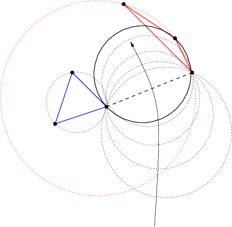
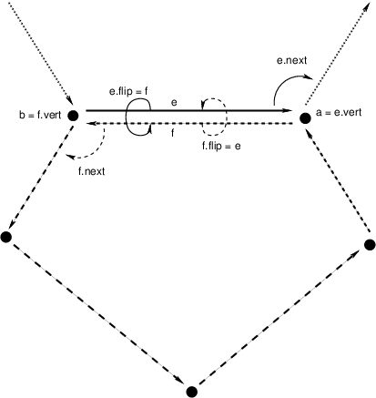

# Voronoi Diagrams and Delaunay Triangulations

Voronoi diagrams specify a partitioning of the plane into convex polygonal regions based on an input set of points, with the points being in one-to-one correspondence with the polygons.  Given the set of points `P`, let `p` be a point in that set; then `V(p)` is the Voronoi polygon corresponding to `p`. The interior of `V(p)` contains the part of the plane closer to `p` than any other point in `P`.

To compute the Voronoi diagram, one actually goes about creating a triangulation of the input points called the _Delaunay triangulation_.  In this structure, all the points in `P` are vertices of a set of non-overlapping triangles that comprise the set `T(P)`.  Each triangle `t` in `T(P)` has the property that the unique circle passing through the vertices of `t` has no points of `P` in its interior.

`T(P)` and `V(P)` (with the latter defined as `{V(p) | p in P}`) are _dual_ to each other in the following sense.  Each triangle in `T(P)` corresponds to a vertex in `V(P)` (a corner of some `V(p)`), each vertex in `T(P)` (which is just a point in `P`) corresponds to a polygon in `V(P)`, and each edge in `T(P)` corresponds to an edge in `V(P)`.  The vertices of `V(P)` are defined as the centers of the circumscribing circles of the triangles in `T(P)`.  These vertices are connected by edges such that if `t(p1)` and `t(p2)` share an edge, then the Voronoi vertices corresponding to those two triangles are connected in `V(P)`.  This duality between structures is important because it is much easier to compute the Delaunay triangulation and to take its dual than it is to directly compute the Voronoi diagram.

This PR provides a divide-and-conquer approach to computing the Delaunay triangulation based on Guibas and Stolfi's 1985 ACM Transactions on Graphics paper.  In this case, the oldies are still the goodies, since only minor performance increases have been achieved over this baseline result---hardly worth the increase in complexity.

The triangulation algorithm starts by ordering vertices according to (ascending) x-coordinate, breaking ties with the y-coordinate.  Duplicate vertices are ignored.  Then, the right and left halves of the vertices are recursively triangulated.  To stitch the resulting triangulations, we find a vertex from each of the left and right results so that the connecting edge is guaranteed to be in the convex hull of the merged triangulations; call this edge `base`.  Now, consider a circle that floats upwards and comes into contact with the endpoints of `base`.  This bubble will, by changing its radius, squeeze through the gap between the endpoints of `base`, and rise until it encounters another vertex.  By definition, this ball has no vertices of `P` in its interior, and so the three points on its boundary are the vertices of a Delaunay triangle.  See the following image for clarification:

  

Here, we note that the red triangle's circumscribing ball contains vertices of the blue triangle, and so we will expect that the red triangle will not be part of the final triangulation.  As such the leftmost edge of the red triangle be deleted before the triangulation can be updated to include the triangle circumscribed by the solid black circle.

This process continues, with the newly created edge serving as the new `base`, and the ball rising through until another vertex is encountered and so on, until the ball exits out the top and the triangulation is complete.

## Mesh Representation

The output of Delaunay triangulation and Voronoi diagrams are in the form of meshes represented by the half-edge structure.  These structures can be thought of as directed edges between points in space, where an edge needs two half-edges to complete its representation.  A half-edge, `e`, has three vital pieces of information: a vertex to which it points, `e.vert`; a pointer to its complementary half-edge, `e.flip`; and a pointer to the next half-edge in the polygon, `e.next`.  The following image might be useful:

    

Note that half-edges are only useful for representing orientable manifolds with boundary.  As such, half edge structures couldn't be used to represent a Moebius strip, nor could they be used for meshes where two polygons share a vertex without sharing an edge.  Furthermore, by convention, polygon edges are wound in counter-clockwise order.  We also allow each half-edge to point to an attribute structure for the face that it bounds.  In the case of a Delaunay triangle, that face attribute would be the circumscribing circle's center; edges on the boundary of a mesh have no face attribute (they are stored as `Option[F]` where `F` is the type of the face attribute).
