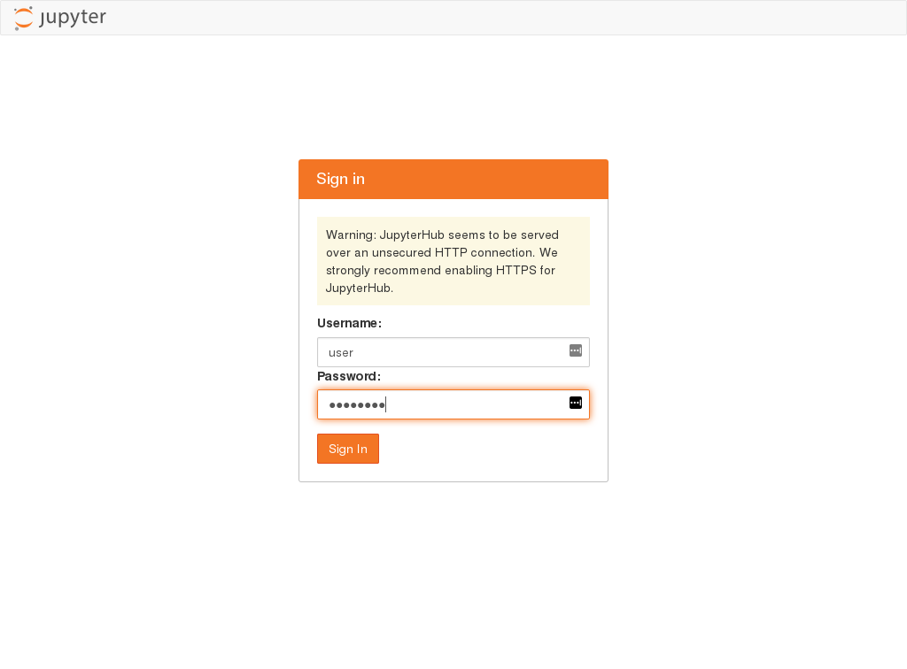
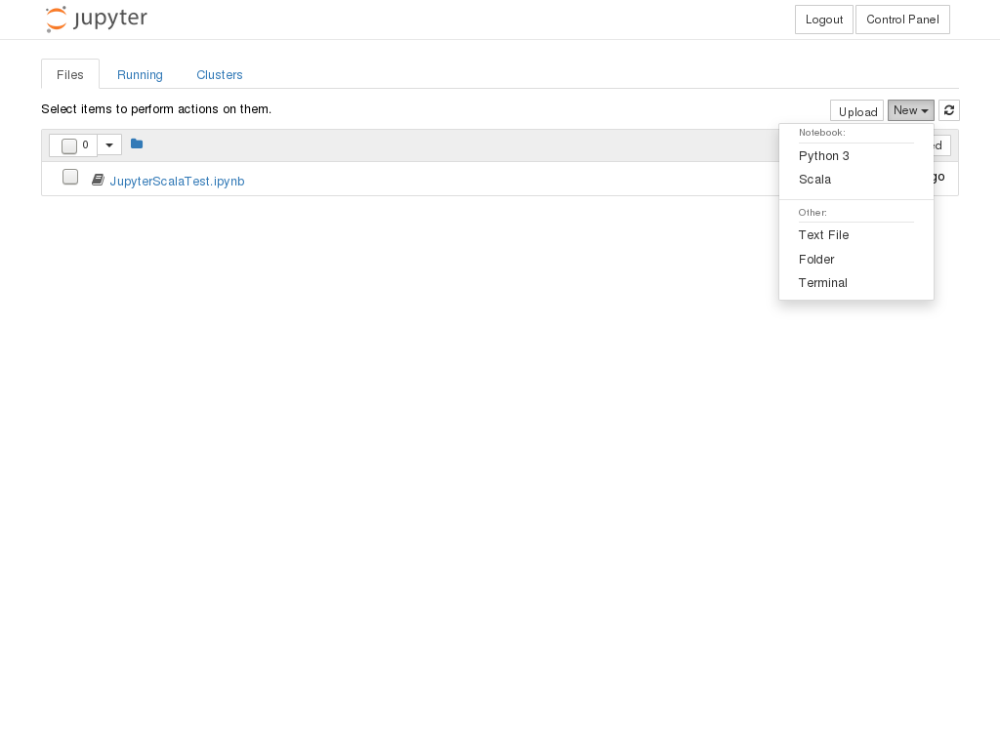
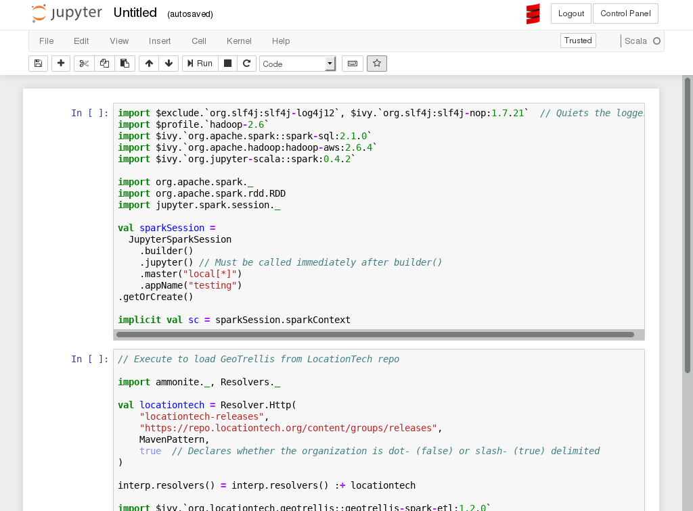

# GeoTrellis EMR

This directory contains a make file to spin up an EMR cluster using [terraform](https://github.com/hashicorp/terraform).

- [Requirements](#requirements)
- [Makefile](#makefile)
- [Running](#running)

## Requirements

You need to install [Terraform 0.10.8](https://github.com/hashicorp/terraform/releases/tag/v0.10.8) and [jq](https://stedolan.github.io/jq/) to parse terraform json configuration (can be installed via brew on Mac OS).

## Settings

[variables.tf.json](terraform/variables.tf.json) contains a set of variables which should be specified to make EMR deployment work.

## Makefile

| Command               | Description
|-----------------------|------------------------------------------------------------|
|terraform-init         |`terraform` init, if it's the first run                     |
|create-cluster         |Create EMR cluster with configurations                      |
|create-jupyter-cluster |Create EMR cluster with jupyter-scala available             |
|destroy-cluster        |Destroy EMR cluster                                         |
|create-cluster         |Create EMR cluster with configurations                      |
|upload-assembly        |Send spark-etl assembly jar to cluster                      |
|proxy                  |Create SOCKS proxy for active cluster                       |
|ssh                    |SSH into cluster master                                     |
|cleanup-zeppelin       |Cleanups all GeoTrellis jars from Zeppelin classpath        |
|restart-zeppelin       |Restart Zeppelin                                            |
|stop-zeppelin          |Stop Zeppelin                                               |
|start-zeppelin         |Start Zeppelin                                              |

## Running

### Creating a Zeppelin Cluster

The Makefile in this directory provides commands to easily set up an EMR
cluster, but doing so does require a minimal amount of configuration.  It will
be necessary to provide your AWS credentials to the Terraform script.

Begin by issuing the commands
```bash
make terraform-init && \
make create-cluster
```

Terraform will prompt for the S3 access key and secret key, as well as the PEM
path for the current account.  You may enter these explicitly, or you may
choose to set environment variables to avoid having to repeatedly fill out the
prompts.  If `TF_VAR_access_key`, `TF_VAR_secret_key`, and `TF_VAR_pem_path`,
these will be discovered by the Terraform script and you will not be prompted
at startup.  The same mechanism can be used to set other variables.
`TF_VAR_spot_price` and `TF_VAR_worker_count` are useful values.

**Note:** long startup times (10 minutes or more) probably indicates that you have
chosen a spot price that is too low.

**Note:** Due to the lack of sophistication in Terraform, you will also be
prompted to set the value of `TF_VAR_s3_notebook_bucket` and
`TF_VAR_s3_notebook_prefix`.  These variables are only used by Jupyter-enabled
clusters and can be set arbitrarily for Zeppelin-only clusters.

This basic cluster will have a running Zeppelin interface that can be accessed
by first creating an SSH tunnel with the command

```bash
make proxy
```

And then browsing to port 8890 of the cluster.


This cluster will not have access to GeoTrellis code until the command

```bash
make upload-assembly
```

is issued.  Upon doing so, you must configure Zeppelin to recognize this
resource by going to the interpreters tab:


Edit the spark interpreter settings by adding the GeoTrellis jar into the
class path (`make upload-assembly` copies the fat jar into, e.g.,
`/tmp/geotrellis-spark-etl-assembly-1.2.0-SNAPSHOT.jar`):


You may then create a new notebook:


wherein GeoTrellis deps can be imported:


### Creating a Jupyter Scala cluster

An alternative to Zeppelin that may be more user-friendly will be to create a
cluster with Jupyter notebook installed.  To do so, set
`TF_VAR_s3_notebook_bucket` and `TF_VAR_s3_notebook_prefix` to appropriate
values (for example, `geotrellis-work` and `user/notebooks`, respectively).
This will set a location on S3 for persistent storage of notebooks.  Then
issue

```bash
make terraform-init &&\
make create-jupyter-cluster
```

**Note:** long startup times (10 minutes or more) probably indicates that you have
chosen a spot price that is too low.  Set `TF_VAR_spot_price` appropriately.

After completing the startup process, navigate to port 8000 of the new
cluster.  You will be greeted with a login prompt.  Log in as `user` with the
password `password`:



You will then be presented with the file browser where you may open existing
notebooks, or create new ones.  To create a new notebook, in the `New`
dropdown in the upper right, choose `Scala`:



**Note:** Python 3 is available as an option, but it will not have
GeoTrellis/Spark capabilities.

In the resulting notebook, you may enter Scala code, but neither GeoTrellis
nor a SparkContext are yet available.  As this notebook interface is based on
Ammonite, there is no `build.sbt` to set up imports, and you must use the
Ammonite import syntax.  To ease initial setup, an extension was provided to
load in the standard boilerplate code for setting up Spark and GeoTrellis.
Click the star icon in the toolbar to insert three new cells at the top of
your notebook:



The first cell can be executed as is, which could take a few minutes to
download the required packages.  This will create the `implicit val sc:
SparkContext` required by many GeoTrellis operations.

To import GeoTrellis, choose **one** of the following two cells to execute.
Either execute the code to load a published version of GeoTrellis from the
LocationTech repo, _or_ execute the cell to load the `spark-etl` fat jar made
available on the cluster using the `make upload-assembly` directive on your
local machine.

After this, it will be possible to import and use GeoTrellis code.  Notebooks
saved during this session will persist in the given S3 directory.
