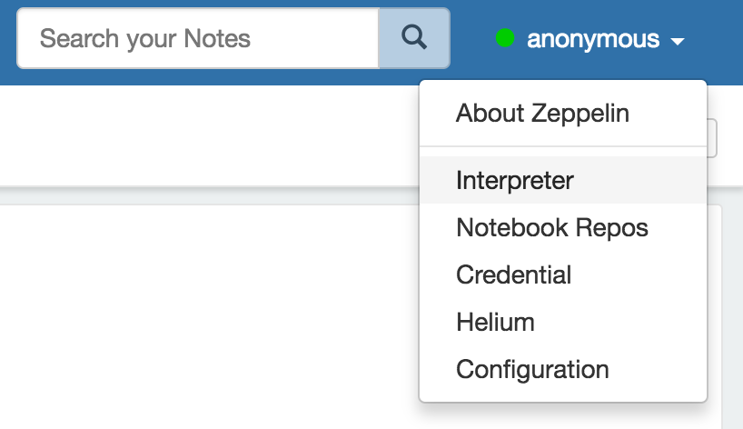
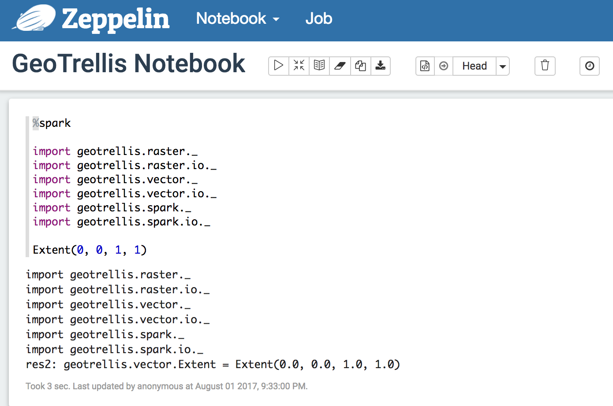

# GeoTrellis EMR

This directory contains a make file to spin up an EMR cluster using [terraform](https://github.com/hashicorp/terraform).

- [Requirements](#requirements)
- [Makefile](#makefile)
- [Running](#running)

## Requirements

You need to install [Terraform 0.10.8](https://github.com/hashicorp/terraform/releases/tag/v0.10.8) and [jq](https://stedolan.github.io/jq/) to parse terraform json configuration (can be installed via brew on Mac OS).

## Settings

[variables.tf.json](terraform/variables.tf.json) contains a set of variables which should be specified to make EMR deployment work.

## Makefile

| Command          | Description
|------------------|------------------------------------------------------------|
|terraform-init    |`terraform` init, if it's the first run                     |
|create-cluster    |Create EMR cluster with configurations                      |
|destroy-cluster   |Destroy EMR cluster                                         |
|create-cluster    |Create EMR cluster with configurations                      |
|proxy             |Create SOCKS proxy for active cluster                       |
|ssh               |SSH into cluster master                                     |
|cleanup-zeppelin  |Cleanups all GeoTrellis jars from Zeppelin classpath        |
|restart-zeppelin  |Restart Zeppelin                                            |
|stop-zeppelin     |Stop Zeppelin                                               |
|start-zeppelin    |Start Zeppelin                                              |

## Running

Create a cluster and upload assembly on EMR master node:

```bash
make terraform-init && \
make create-cluster && \
make upload-assembly
```

It will be necessary to provide your AWS credentials to the Terraform script.
Terraform will prompt for the access key, the secret key, and the PEM path for
the current account.  You may enter these explicitly, or you may choose to set
environment variables to avoid having to repeatedly fill out the prompts.  If
`TF_VAR_access_key`, `TF_VAR_secret_key`, and `TF_VAR_pem_path`, these will be
discovered by the Terraform script and you will not be prompted at startup.
The same mechanism can be used to set other variables.  `TF_VAR_spot_price`
and `TF_VAR_worker_count` are useful values.

Note: long startup times (greater than 5 or 6 minutes) probably indicates that
you have chosen a spot price that is too low.

Make proxy and access Zeppelin though UI:

```bash
make proxy
```


Create a new notebook: 


Go into interpreters tab:



Edit spark interpreter, and add GeoTrellis jar into deps (make sure that you uploaded GeoTrellis 
jar via `make upload-assembly` into `/tmp/geotrellis-spark-etl-assembly-1.2.0-SNAPSHOT.jar` directory):


After that GeoTrellis deps can be imported:


